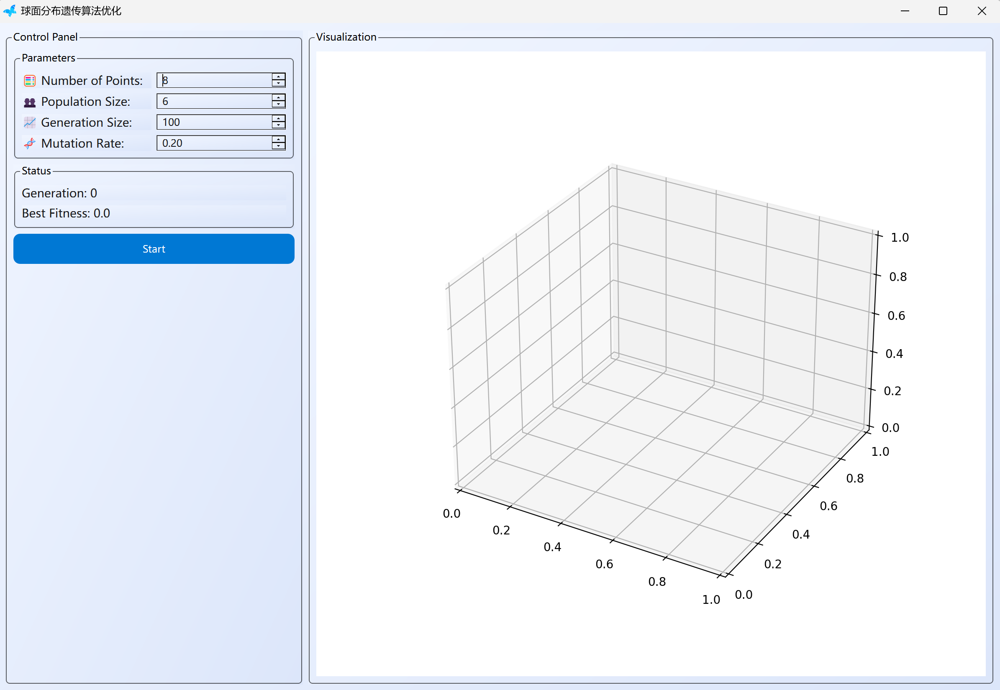
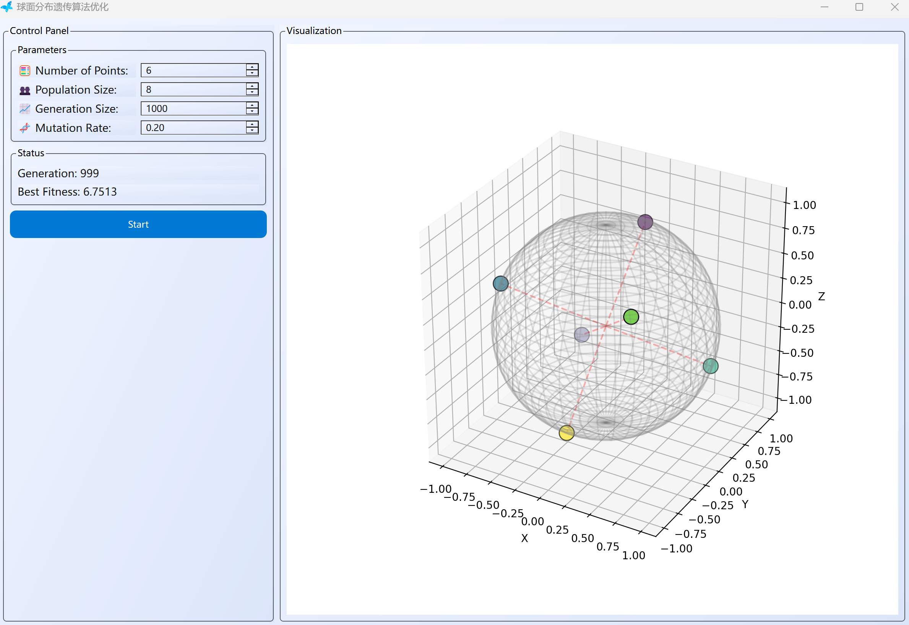

<center>
  
</center>

#  Monica_Genetic 
> 球面均匀分布遗传算法求解演示器

> 2025-3-22

<!-- TOC -->
* [ Monica_Genetic](#img-srcsourcemorfonicapng-altmorfonica-width30-monica_genetic-)
  * [简介](#简介)
  * [安装](#安装)
    * [应用程序安装](#应用程序安装)
    * [源码安装](#源码安装)
    * [使用指南](#使用指南)
  * [代码结构介绍](#代码结构介绍)
  <!-- TOC -->
## 简介
Monica Genetic 是一款基于球面均匀分布遗传算法的求解器，旨在为用户提供一个可视化的界面来观察和理解遗传算法的运行过程，该项目使用 Python 语言编写
## 安装
### 应用程序安装
绿色安装，开袋即食

点击exe文件即可运行

### 源码安装
- 1. 一键式配置：拉取后点击`create_exe.bat`按引导创建名为`pyqt`的环境，若无anaconda也会自动安装并配置环境变量（有的话就不要试了，我也没在自己电脑上试过全程，只能说，大体能装）
  2. 执行`conda env create -f environment.yaml`安装名为`pyqt`的环境
- 打开终端激活pyqt环境
  ```bash
    conda activate pyqt
  ```
- 运行程序
  ```bash
    python genetic.py
  ```
### 使用指南
运行程序后，界面如下

左侧为控制区，右侧为图形化显示区
- Parameters(参数设置区)
  - `Number of Points`：面上点数
  - `Population Size`：种群大小
  - `Generation Size`：遗传代数
  - `Mulation Rate`：变异率
-  Statue(遗传状态区)
  - Generation：当前代数
  - Best Fitness：当前最优适应值
- `start`(开始执行)

右侧展示区可以用光标拖动旋转

运行结果样例


## 代码结构介绍

- `genetic.py`：主程序入口，包括了遗传算法的主逻辑与UI界面
- `math_tools.py`:数学工具库，主要为位运算计算
- 内部有规范注释，易于阅读
> Created by [Santerc](https://github.com/Santerc) with Heart